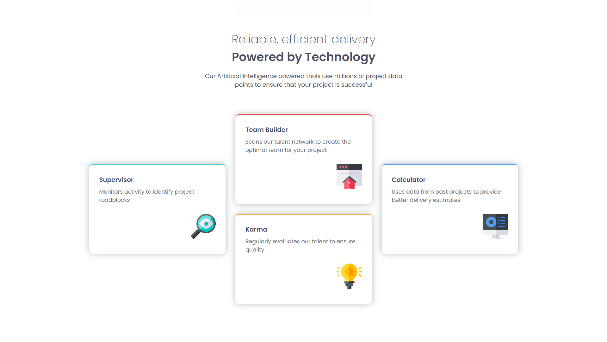

# Project Name 🚀

Welcome to the **Reliable, Efficient Delivery** project, a frontend-only solution powered by modern web technologies! This project showcases a responsive design using CSS Grid, highlighting AI-powered tools to optimize project management, team building, and delivery estimates.

## Overview 🌟

This repository contains a static web-based frontend showcasing AI-powered tools designed to enhance project success. The tools include:

- **Supervisor**: Monitors activity to identify project roadblocks 🔍
- **Team Builder**: Scans talent networks to create optimal teams 🏠
- **Karma**: Evaluates talent to ensure quality 💡
- **Calculator**: Uses past project data for better delivery estimates 💻

## Features ✨

- Responsive design using CSS Grid
- Modern and intuitive UI
- Pure frontend implementation (HTML, CSS)

## Installation 🛠️

1. Clone the repository:
   ```bash
   git clone https://github.com/nisargvekariya01/Four-Card-Feature-Section/tree/main
   ```
2. Navigate to the project directory:
   ```bash
   cd Four-Card-Feature-Section
   ```
3. Open `index.html` in a web browser to view the application.

## Usage 📋

- Explore the cards to understand each tool's functionality.
- Resize the window to see the responsive design with CSS Grid in action.

## Live Demo 🌐

Check out the live demo of the project [here](https://your-live-demo-url.com). Experience the frontend design in action!

## Screenshots 📸

### Desktop View
 <br>

### Mobile View
 <br>

## Contributing 🤝

Feel free to contribute! Please fork the repository and submit a pull request with your changes.

## Made with ❤️ by [Nisarg Vekariya](https://github.com/nisargvekariya01)
